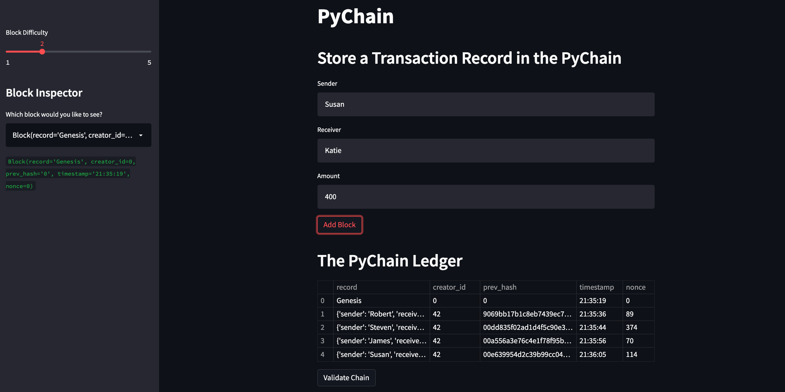

# PyChain Ledger

Welcome to the PyChain Leger where you can enter transcations and store them on the PyChain blockchain.

## How to add a transaction:
1. Enter the Sender, Receiver, and Amount in the appropriate fields.
2. Click the Add Block button to add this transactin to the ledger.  NOTE: Double check your work before adding a transcation to the blockchain.  Once a transation has been added, it cannot be deleted.
3. Thats it.  The transcation has been added.

## How to view details of a transaction:
1. To view the details of a transaction, navigate to the left panel and locate the dropdown menu under Block Inspector.  
2. Click the dropdown menu and select the transaction that you wish to view.  Details for the transcton will appear below in green.
